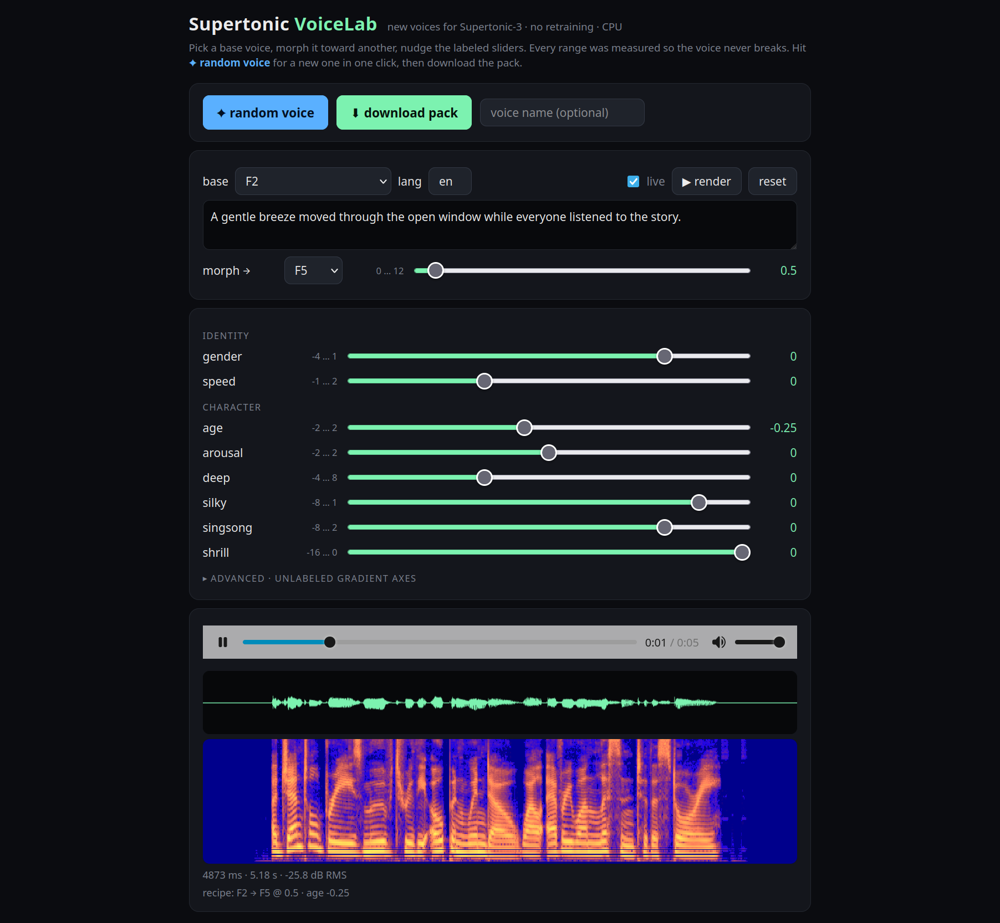

<h1 align="center">Supertonic VoiceLab & New VoicePacks</h1>
<p align="center"><b>40 brand-new voices for Supertonic-3, free to download. Plus a one-click lab to make your own.</b></p>
<p align="center">
<a href="new-voices/">⬇ Download the voice packs</a> ·
<a href="new-voices/README.md">🎧 Listen to all 50 samples</a> ·
<a href="#make-your-own-voice-in-one-click">✦ Make your own</a> ·
<a href="#how-it-works">🔬 How it works</a>
</p>

[Supertonic-3](https://github.com/supertone-inc/supertonic) is the fastest open on-device TTS around, but it ships with exactly ten voices, and Supertone shut down the hosted Voice Builder in August 2026. So there was no way to get an eleventh voice.

<p align="center"></p>

Now there is. This repo contains **40 new voice packs** that drop straight into Supertonic, English samples for every one of them, and the sliders that made them: gender, speed, age, arousal, deep, silky, singsong, shrill. Each slider has a measured safe range, so whatever you dial in still speaks clearly. No retraining, no GPU, no cloud.

## Download the voice packs

Every voice is a single JSON file in Supertonic's native `voice_style` format. Grab the file, point Supertonic at it, done.

```python
from supertonic import TTS
tts = TTS()   # downloads Supertonic-3 on first run
voice = tts.get_voice_style_from_path("new-voices/P23.json")
wav, _ = tts.synthesize("Hello from a voice that did not exist yesterday.", voice_style=voice, lang="en")
tts.save_audio(wav, "hello.wav")
```

Using audio.cpp or another Supertonic runtime? Copy the JSON into the model's `voice_styles/` folder next to `F1.json` and call it by name.

**Top 10 by predicted quality** (UTMOSv2; the best official voice scores 3.40). The full ranked list of all 40, with samples, is in [new-voices/README.md](new-voices/README.md).

| voice | sample | pack | sex · age | MOS | recipe |
|---|---|---|---|---|---|
| **P23** | [▶ listen](samples/en/P23.mp3) | [⬇ pack](new-voices/P23.json) | M · 23 | 3.625 | M4 → M5 @ 0.75 · speed -0.5 |
| **P35** | [▶ listen](samples/en/P35.mp3) | [⬇ pack](new-voices/P35.json) | M · 25 | 3.51 | M1 → M5 @ 1.5 |
| **P12** | [▶ listen](samples/en/P12.mp3) | [⬇ pack](new-voices/P12.json) | F · 28 | 3.508 | F5 → M1 @ 0.5 · ax5 +1, gender +0.5 |
| **P26** | [▶ listen](samples/en/P26.mp3) | [⬇ pack](new-voices/P26.json) | M · 26 | 3.492 | M1 → M5 @ 1.75 · speed -0.25 |
| **P01** | [▶ listen](samples/en/P01.mp3) | [⬇ pack](new-voices/P01.json) | F · 43 | 3.424 | F1 → F3 @ 1.5 · speed +0.5 |
| **P36** | [▶ listen](samples/en/P36.mp3) | [⬇ pack](new-voices/P36.json) | M · 47 | 3.414 | F1 → M5 @ 2.25 |
| **P10** | [▶ listen](samples/en/P10.mp3) | [⬇ pack](new-voices/P10.json) | M · 26 | 3.398 | F1 → M4 @ 1.5 |
| **P03** | [▶ listen](samples/en/P03.mp3) | [⬇ pack](new-voices/P03.json) | M · 38 | 3.352 | F5 → M3 @ 0.75 · speed -0.5, gender -1.75 |
| **P08** | [▶ listen](samples/en/P08.mp3) | [⬇ pack](new-voices/P08.json) | M · 36 | 3.316 | M1 → M2 @ 2.25 |
| **P00** | [▶ listen](samples/en/P00.mp3) | [⬇ pack](new-voices/P00.json) | M · 29 | 3.295 | F2 → M5 @ 0.75 |

The voices are not named on purpose. Listen to the sample, pick the one you like, rename the file.

## Make your own voice in one click

```bash
pip install supertonic numpy soundfile
git clone https://github.com/franciscocarloserra/supertonic-voicelab && cd supertonic-voicelab
python panel/server.py        # open http://localhost:7894
```

Press **✦ random voice**. You get a new voice, rendered on CPU in about a second. Like it? Press **⬇ download pack**. Want to steer? Pick a base voice, morph it toward another one, and move the sliders. The ranges you see are the measured limits where the voice starts to break, so you cannot leave the safe zone.

Prefer the terminal:

```bash
python -m voicelab.mix --base F1 --target M5 --t 0.75 --set gender=-1 mix_age=2 --out my_voice.json --say "Testing one two three"
```

## How it works

A Supertonic-3 voice is two small tensors: `style_ttl` (50×256, what the voice sounds like) and `style_dp` (8×16, how fast it talks). Every row is a unit vector. That is the whole "voice". So a new voice is just a new point in that space, and the question becomes: *which points still sound like a person?*

1. **Map the space.** Rows are individually inert, only global directions matter. Speed lives entirely in `style_dp`. Loudness breaks first, then voicing, and only much later intelligibility. The all-zero pack is still a valid voice.
2. **Define "valid" from data, not by hand.** A candidate passes if Whisper transcribes it perfectly and its pitch, voiced fraction, loudness and duration stay inside the ranges spanned by the ten official voices, plus an explicit margin. Every threshold is derived from the officials.
3. **Find labeled directions.** `gender` is mean(female) − mean(male). `speed` is mean(3 fastest) − mean(3 slowest). The character sliders come from ridge regression of classifier labels (audeering age and arousal, Vox-Profile deep/silky/singsong/shrill) on the mixing weights of 560 random blends of the officials, refined over 5 iterations. Only labels with R² ≥ 0.4 made the cut. Classifier *gradients* were tried first and rejected: they move the label while destroying the voice.
4. **Measure the limits.** Each direction is pushed on F1 and M1, both signs, doubling the scale until validation fails. The last valid scale is the slider bound. Pairs of officials can be morphed and even extrapolated: 47 of 48 pairs survive t = 1.5, many reach t = 12.
5. **Generate and rank.** Random recipes inside the bounds, rendered, validated, scored with UTMOSv2 and Audiobox-Aesthetics. 40 of 44 candidates passed on the first batch. Six of them score above the best official voice.

| | official voices (10) | new voices (40) |
|---|---|---|
| UTMOSv2 (predicted MOS) | 2.58 – 3.40 | 2.46 – 3.63 |
| Audiobox production quality | 7.68 – 8.10 | 6.97 – 8.09 |
| Whisper WER (en, es) | 0 | 0 |
| predicted age | 22 – 40 | 18 – 53 |

What did **not** work, documented so nobody repeats it: inverting a voice pack from audio with the flow-matching loss (the loss barely tells speakers apart), classifier-gradient axes (adversarial), editing single rows (inert), retraining the style encoder (200–350 GPU-hours, no training code released). Details in [results/](results/).

## The sweeps, and what they taught us

Everything below was measured on the 10 official voices with an automatic judge (Whisper, pitch/voicing/loudness/duration ranges, ECAPA speaker embedding, audeering age/sex/emotion, Vox-Profile voice quality, UTMOSv2, Audiobox-Aesthetics). No human listened until the end. Details and raw numbers: [results/](results/).

| sweep | question | answer |
|---|---|---|
| **Gender & speed vectors** | Does mean(F) − mean(M) move sex? Does fastest − slowest move tempo? | Yes, both. Speed lives entirely in `style_dp`; the full-tensor version drags female pitch into the male range. |
| **PCA on the 10 packs** | Are the top principal components usable sliders? | ±3 stays intelligible but unlabeled; superseded by the labeled sliders. |
| **Harmonics + WER grid** | Where does each direction break? | Gender ±2 keeps voicing; +10 goes breathy. Speed +4 is the ceiling (1.55× faster); +10 is noise. |
| **Row-by-row edits** | Is identity stored in specific rows? | No. Rotating any single row by 90° changes nothing. Identity is distributed. |
| **Multilingual baseline** | Do the officials transcribe perfectly? | es/en WER 0; pt/fr misses are Whisper homophones. This baseline defines "valid". |
| **ECAPA-Jacobian axes** | Can gradients of a speaker embedding give orthogonal identity axes? | 10 axes, 5× more identity change per unit than random directions, but they hit the validity wall at scale 1–4 and are unlabeled. |
| **Classifier-gradient axes** | Can the gradient of an age/sex classifier steer a voice? | No. Adversarial: the label moves, the voice breaks at scale 1. |
| **Pair extrapolation** | How far past voice B can you push A → B? | 47/48 pairs valid at t = 1.5, many to t = 12; audio saturates past t ≈ 3–4 after re-normalization. |
| **Random mixes + regression** | Regress classifier labels on the mixing weights of 560 random blends? | Works. Six labels with R² ≥ 0.4: age, arousal, deep, silky, singsong, shrill. Those became the sliders. |
| **Combined-slider budget** | How much of each limit survives when several sliders are active? | ~75 % with 2–4 sliders, ~50 % with 8. |
| **Voice-quality probe** | Which Vox-Profile textures does this TTS expose? | Only deep, silky, singsong, shrill, flowing, loud vary. Husky, raspy, fry, nasal are always zero: not addressable. |
| **Style inversion from audio** | Can a pack be recovered from a wav with the model's own flow-matching loss? | No. The loss separates speakers by ~6 % while per-sample noise is ±20 %. Perceptual-loss inversion (Mimocro, 1500 iters) stayed 94 % at its init. |
| **Generation + ranking** | Random recipes inside the bounds, scored by UTMOSv2 and Audiobox | 40/44 valid in 88 s; 6 beat the best official voice. |

**Pitfalls worth knowing before you extend this**

* WER alone is blind. An all-zero `style_ttl` still transcribes perfectly. Loudness and voicing break first; you need them in the judge.
* Always re-normalize rows after arithmetic. The model expects unit vectors; without renorm the "limits" mean nothing.
* Whisper is a noisy judge in pt/fr (homophones). Calibrate the baseline per language, never assume 0.
* The audio.cpp analysis server leaks VRAM over thousands of requests. Restart it above a threshold or your sweep dies at 3 a.m.
* librosa `pyin` was 70 % of wall time in the sweeps. Swap it for `pyworld` before any large run.
* Retraining the style encoder is a 200–350 GPU-hour job with no released training code. Vector arithmetic gets you 90 % of the way for free.

## Repository

| path | what |
|---|---|
| [`new-voices/`](new-voices/) | the 40 packs, [ranked table](new-voices/README.md), [`index.json`](new-voices/index.json) for scripts |
| [`samples/en/`](samples/en/) | one English mp3 per voice, same sentence, officials included |
| [`panel/`](panel/) | the lab: random voice, morph, sliders, download |
| [`voicelab/`](voicelab/) | the arithmetic (`lib.py`) and the CLI (`mix.py`) |
| [`vectors/`](vectors/) | slider directions and their [measured limits](vectors/limits.json) |
| [`results/`](results/) | every experiment: what was tried, what was measured, what to try next |
| [`params.json`](params.json) | setup knobs. Measured data stays in `vectors/limits.json` and `new-voices/index.json` |
| [`AGENTS.md`](AGENTS.md) | for coding agents: how to consume the voices and how to continue the research |

## License

Code: MIT. The voice packs are derivatives of the Supertonic-3 voice styles and inherit the model's [Open RAIL-M license](https://github.com/supertone-inc/supertonic/blob/main/LICENSE), including its use restrictions.
